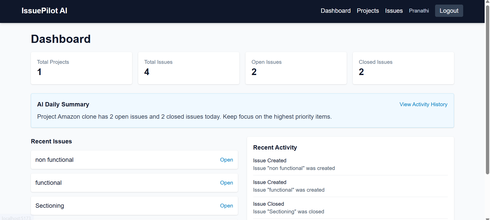
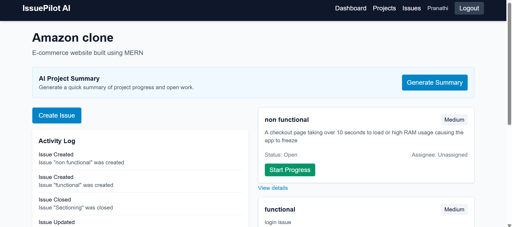
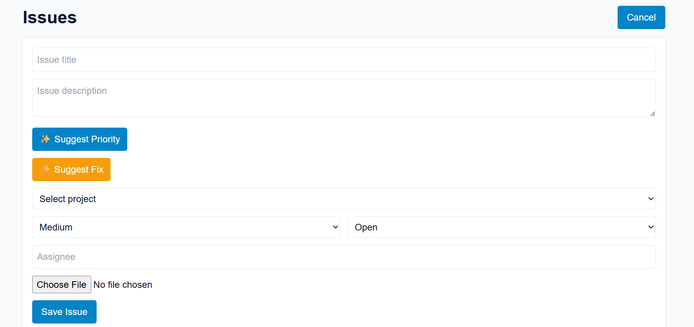

# 🚀 Issue_PilotAI – AI-Powered Issue Tracking Platform

Issue_PilotAI is a full-stack MERN application inspired by Jira and GitHub Issues. It helps developers efficiently manage software projects by tracking bugs, organizing issues, monitoring progress, and leveraging AI to prioritize and analyze issues.

The project is designed with a clean MVC architecture and integrates Groq AI to provide intelligent bug analysis, priority suggestions, and project summaries. 

---

## ✨ Features

### 🔐 Authentication
- User Registration
- User Login
- JWT Authentication
- Password Hashing using bcrypt
- Protected Routes

---

### 📊 Dashboard
- Total Projects
- Total Issues
- Open Issues
- Closed Issues
- Recent Issues Overview

---

### 📁 Project Management
- Create Project
- View Projects
- Edit Project
- Delete Project

Each project contains:
- Project Name
- Description
- Creation Date

---

### 🐞 Issue Management
Create and manage issues with:

- Title
- Description
- Priority
- Status
- Assigned To (Optional)
- Screenshot Upload

Users can:

- Create Issues
- Edit Issues
- Delete Issues
- View Issue Details

---

### 📸 Screenshot Upload

Upload bug screenshots using:

- Multer
- Cloudinary

Only the Cloudinary image URL is stored in MongoDB.

---

### 🔍 Search & Filter

Search Issues by:

- Title

Filter Issues by:

- Priority
- Status

---

### 📝 Activity Log

Automatically records project activities such as:

- Project Created
- Issue Created
- Issue Updated
- Issue Closed

---

## 🤖 AI Features

### ✨ AI Priority Suggestion

Analyzes the issue description and recommends an appropriate priority:

- Low
- Medium
- High

---

### 🛠 AI Bug Fix Suggestion

Analyzes the bug description and provides:

- Possible Root Cause
- Suggested Fix
- Additional Notes

---

### 📈 AI Project Summary

Generates a concise overview of the project including:

- Completed Issues
- Pending Issues
- Overall Progress
- Developer Insights

---

# 🛠 Tech Stack

## Frontend

- React (Vite)
- React Router
- Axios
- Tailwind CSS

## Backend

- Node.js
- Express.js

## Database

- MongoDB
- Mongoose

## Authentication

- JWT
- bcrypt

## File Upload

- Multer
- Cloudinary

## AI Integration

- Groq API

## Architecture

- MVC Pattern
- REST APIs

---

# 📂 Project Structure

```text
Issue_PilotAI
│
├── backend
│   ├── src
│   │   ├── config
│   │   ├── controllers
│   │   ├── middleware
│   │   ├── models
│   │   ├── routes
│   │   ├── services
│   │   ├── app.js
│   │   └── server.js
│   │
│   ├── uploads
│   ├── package.json
│   └── .env
│
├── frontend
│   ├── src
│   │   ├── components
│   │   ├── context
│   │   ├── pages
│   │   ├── services
│   │   ├── App.jsx
│   │   ├── main.jsx
│   │   └── index.css
│   │
│   ├── package.json
│   └── vite.config.js
│
├── docs
│
├── screenshots
│
├── README.md
└── .gitignore
```

---

# ⚙️ Installation

## Clone Repository

```bash
git clone https://github.com/your-username/Issue_PilotAI.git

cd Issue_PilotAI
```

---

## Backend Setup

```bash
cd backend

npm install

npm start
```

---

## Frontend Setup

```bash
cd frontend

npm install

npm run dev
```

---

# 🔑 Environment Variables

Create a `.env` file inside the **backend** folder.

PORT=5000

MONGO_URI=your_mongodb_connection_string

JWT_SECRET=your_secret_key

CLOUDINARY_CLOUD_NAME=your_cloud_name

CLOUDINARY_API_KEY=your_api_key

CLOUDINARY_API_SECRET=your_api_secret

GROQ_API_KEY=your_groq_api_key
```

---

# 📸 Screenshots


## Dashboard



---

## Projects Page



---


## Create Issue



---


# 🔮 Future Enhancements

- Team Collaboration
- User-based Issue Assignment
- Email Notifications
- Role-Based Access Control
- Kanban Board
- Analytics Dashboard
- Due Dates
- Labels
- Project Reports

---

# 💡 Learning Outcomes

Through this project I gained practical experience with:

- MERN Stack Development
- REST API Design
- MVC Architecture
- JWT Authentication
- MongoDB Relationships
- Cloudinary Integration
- Multer File Uploads
- AI API Integration using Groq
- CRUD Operations
- Search & Filter Functionality
- Activity Logging
- Error Handling
- Protected Routes


